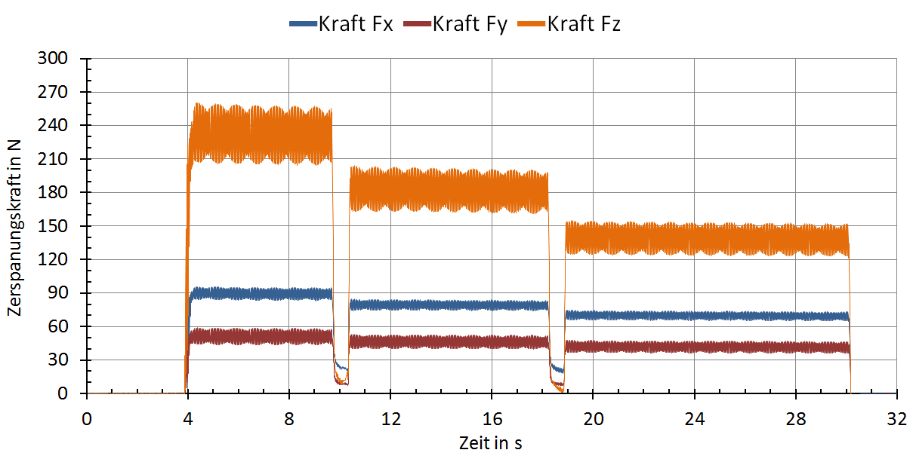

<!--
author:   Your Name

email:    your@mail.org

version:  0.0.1

language: en

narrator: US English Female

comment:  Try to write a short comment about
          your course, multiline is also okay.

link:     https://cdn.jsdelivr.net/chartist.js/latest/chartist.min.css

script:   https://cdnjs.cloudflare.com/ajax/libs/PapaParse/4.1.2/papaparse.min.js
script:   https://cdn.jsdelivr.net/chartist.js/latest/chartist.min.js

translation: Deutsch  translations/German.md

translation: Français translations/French.md


@evalWithChartist
<script>
Papa.parse("@0", {
  download: true,
  dynamicTyping: true,
  delimiter: "\t",
  complete: function(results, file) {@input}
}
);
</script>

<div class="ct-chart ct-golden-section persistent" id="@1"></div>

@end

-->

# HS2 Praktikum Fräsen

Generischer Praktikumseinführungstext hier.

## Hintergrundliteratur

Als Text mit Diagrammen und [links](https://github.com).



Als Literaturverweise:
`Akgün, Ö, Hoffmann, R & Sarkar, S 2018, Memory consistency models using constraints. in The Seventeenth Workshop on Constraint Modelling and Reformulation (ModRef 2018), Proceedings. 24th International Conference on Principles and Practice of Constraint Programming (CP 2018), Lille, France, 27/08/18.`


Oder via !?[embedded media](https://www.youtube.com/embed/bICfKRyKTwE)

You can use common [Markdown](https://github.com/adam-p/markdown-here/wiki/Markdown-Cheatsheet) syntax to create your course, such as:

1. Lists
2. ordered or

   * unordered
   * ones ...

| Header 1   | Header 2   |
| :--------- | :--------- |
| Item 1     | Item 2     |


### Styling

<!-- class = "animated rollIn" style = "animation-delay: 2s; color: purple" -->
The whole text-block should appear in purple color and with a wobbling effect.
Which is a **bad** example, please use it with caution ...
~~ only this is red ;-) ~~ <!-- class = "animated infinite bounce" style = "color: red;" -->


## Fragen und Parameterberechnungen

### A Textquiz

What did the **fish** say when he hit a **concrete wall**?

    [[dam]]

### Multiple Choice

Just add as many points as you wish:

    [[X]] Only the **X** marks the correct point.
    [[ ]] Empty ones are wrong.
    [[X]] ...

### Single Choice

Just add as many points as you wish:

    [( )] ...
    [(X)] <-- Only the **X** is allowed.
    [( )] ...

### Parameter und Berechnungsvorschriften

Feste Versuchs-Parameter vorgeben, berechnete Werte für die variablen Parameter können von den Teilnehmenden im Berechnungen-Feld eingetragen werden. Im Script-Bereich die Überprüfung programmieren.

``` json     -Parameter.json
{
  "Parameter1" :  1.23,
  "Parameter2"  :  4
}
```
``` json    +Berechnungen.json
{
  "Vorschub" :  1,
  "Drehzahl"  :  4
}
```
<script>
  // insert the JSON dataset into the local variable data
  let fixed = @input(0);
  let params = @input(1);
  // eval the script that uses this dataset
  if(params.Vorschub+params.Drehzahl < fixed.Parameter1) {
    "Drehzahl zu hoch"; }
  else {
    if(params.Vorschub+params.Drehzahl > fixed.Parameter2){
    "Vorschub zu hoch"; }
    else {
      "OK"
    }
  }
</script>


## Versuchsdurchführung

Hier eine Kombination aus Protokollvorlage und Textfeldern einfügen

[[___ ___ ___ ___ ]]

Mehr Text und noch ein Textfeld

[[___ ___ ___ ___ ]]

Lorem ipsum dolor sit amet, consectetur adipisicing elit, sed do eiusmod tempor incididunt ut labore et dolore magna aliqua. Ut enim ad minim veniam, quis nostrud exercitation ullamco laboris nisi ut aliquip ex ea commodo consequat. Duis aute irure dolor in reprehenderit in voluptate velit esse cillum dolore eu fugiat nulla pariatur. Excepteur sint occaecat cupidatat non proident, sunt in culpa qui officia deserunt mollit anim id est laborum.


## Aufbereitung und Auswertung

### Eingabe der Versuchskennung
Um auf die gespeicherten Versuchsdaten zugreifen zu können, muss die beim Speichern des Versuchs angezeigte Kennung hier einmalig eingegeben werden:

``` js     +experimentID.js
12345
```
<script>
  liaStorage.setItems({"experimentID": `@input(0)`});
  "Updated experiment ID";
  liaStorage.getItems("experimentID").experimentID;
</script>

### Section 1

Mehr Text und noch ein Textfeld

[[___ ___ ___ ___ ]]

Lorem ipsum dolor sit amet, consectetur adipisicing elit, sed do eiusmod tempor incididunt ut labore et dolore magna aliqua. Ut enim ad minim veniam, quis nostrud exercitation ullamco laboris nisi ut aliquip ex ea commodo consequat. Duis aute irure dolor in reprehenderit in voluptate velit esse cillum dolore eu fugiat nulla pariatur. Excepteur sint occaecat cupidatat non proident, sunt in culpa qui officia deserunt mollit anim id est laborum.

<div class="ct-chart ct-golden-section" id="chart1"></div>
<script>
// Initialize a Line chart in the container with the ID chart1
new Chartist.Line('#chart1', {
  labels: [1, 2, 3, 4],
  series: [[100, 120, 180, 200]]
});
</script>

### Section 2
Mehr Text und noch ein Textfeld

[[___ ___ ___ ___ ]]

Lorem ipsum dolor sit amet, consectetur adipisicing elit, sed do eiusmod tempor incididunt ut labore et dolore magna aliqua. Ut enim ad minim veniam, quis nostrud exercitation ullamco laboris nisi ut aliquip ex ea commodo consequat. Duis aute irure dolor in reprehenderit in voluptate velit esse cillum dolore eu fugiat nulla pariatur. Excepteur sint occaecat cupidatat non proident, sunt in culpa qui officia deserunt mollit anim id est laborum.


### Section 3/Visualisierung Rauheit

W
<span id="test">
</span>
<div class="ct-chart ct-golden-section" id="chartR1"></div>
<script>
document.getElementById('test').innerHTML =
liaStorage.getItems("experimentID").experimentID;
    Papa.parse("http://localhost:8000/Beispieldaten_eLAB/Daten_Rauheitsmessung/Messdaten_W-Profil.asc1", { //"http://localhost:8000/Beispieldaten_eLAB/Daten_Rauheitsmessung/dummy"
    download: true,
    delimiter: " ",
    complete: function(results, file) {
        results.data = results.data[0].map((col, i) => results.data.map(row => row[i]));
        //console.log("Finished:", results.data);
        new Chartist.Line('#chartR1', {
          labels: [results.data[0]],
          series: [results.data[1]]
        });
    }
});
</script>
R
<div class="ct-chart ct-golden-section" id="chartR2"></div>
<script>
    Papa.parse("http://localhost:8000/Beispieldaten_eLAB/Daten_Rauheitsmessung/Messdaten_R-Profil.asc", {
    download: true,
    delimiter: " ",
    complete: function(results, file) {
        results.data = results.data[0].map((col, i) => results.data.map(row => row[i]));
        //console.log("Finished:", results.data);
        new Chartist.Line('#chartR2', {
          labels: [results.data[0]],
          series: [results.data[1]]
        });
    }
});
</script>
P
<div class="ct-chart ct-golden-section" id="chartR3"></div>
<script>
    Papa.parse("http://localhost:8000/Beispieldaten_eLAB/Daten_Rauheitsmessung/Messdaten_P-Profil.asc", {
    download: true,
    delimiter: " ",
    complete: function(results, file) {
        results.data = results.data[0].map((col, i) => results.data.map(row => row[i]));
        //console.log("Finished:", results.data);
        new Chartist.Line('#chartR3', {
          labels: [results.data[0]],
          series: [results.data[1]]
        });
    }
});
</script>


### Section 3/Visualisierung Zerspankraft

<div class="ct-chart ct-golden-section" id="chartZ1"></div>
<script>
    Papa.parse("http://localhost:8000/Beispieldaten_eLAB/Daten_Zerspankraftmessung/Zerspankraftmessung.txt", { //"http://localhost:8000/Beispieldaten_eLAB/Daten_Rauheitsmessung/dummy"
    download: true,
    delimiter: "\t",
    complete: function(results, file) {
        results.data = results.data[0].map((col, i) => results.data.map(row => row[i]));
        //console.log("Finished:", results.data);
        new Chartist.Line('#chartZ1', {
          labels: [results.data[0]],
          series: [results.data[1],results.data[2],results.data[3]]
        });
    }
});
</script>
### Section 3/Durchmesser


``` javascript
results.data = results.data[0].map((col, i) => results.data.map(row => row[i]));
//console.log("Finished:", results.data);
var count=0;
for (var i=3; i--;) {
  count+=parseFloat(results.data[1][i]);
}
count = Math.round(count);
new Chartist.Pie('#chartD333', {
series: [results.data[1][0]-results.data[1][1],results.data[1][1]-results.data[1][2],results.data[1][2]]
}, {
  donut: true,
  donutWidth: 10,
  donutSolid: true,
  startAngle: 270,
  total: Math.round(results.data[1][0])* 2,
  showLabel: true
});
```
@evalWithChartist(http://localhost:8000/Beispieldaten_eLAB/Daten_Maß/Durchmesser.txt2,chartD333)


### Section 3/Verschleiß


### Section 3/Spanart/Form

!?[Video](http://127.0.0.1:8000/Beispieldaten_eLAB/Daten_Spanart-Spanform/test1_NX8.mp4)


### Section 4/Conclusion
Mehr Text und noch ein Textfeld

[[___ ___ ___ ___ ]]

Lorem ipsum dolor sit amet, consectetur adipisicing elit, sed do eiusmod tempor incididunt ut labore et dolore magna aliqua. Ut enim ad minim veniam, quis nostrud exercitation ullamco laboris nisi ut aliquip ex ea commodo consequat. Duis aute irure dolor in reprehenderit in voluptate velit esse cillum dolore eu fugiat nulla pariatur. Excepteur sint occaecat cupidatat non proident, sunt in culpa qui officia deserunt mollit anim id est laborum.
